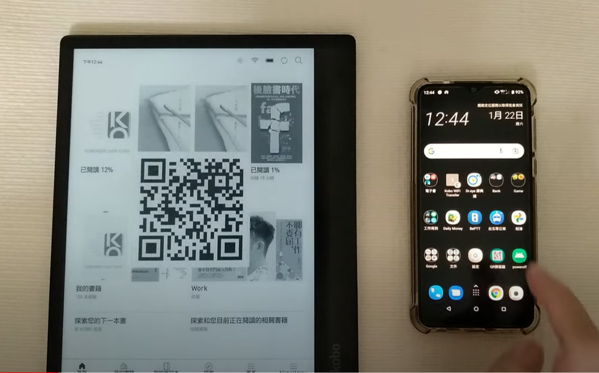

# kobofileserver
Run it on Kobo device, then use browser to transfer file to device.

# Installation
1. Install [NickelMenu](https://github.com/pgaskin/NickelMenu), I use it to launch the application.
2. Insert the device into your PC over USB.
3. Put KoboFileServer folder in ".adds" folder of device.
4. Create "kobofileserver" folder on device.
5. Modify NickelMenu config file.
```
menu_item :main    :Force Wi-Fi On (toggle)  :nickel_setting     :toggle:force_wifi
menu_item :main    :IP Address               :cmd_output         :500:/sbin/ifconfig | /usr/bin/awk '/inet addr/{print substr($2,6)}'
menu_item :main    :Import Books             :nickel_misc        :rescan_books_full
menu_item :main    :KoboFileServer (toggle)  :cmd_output         :500:quiet  :/usr/bin/pkill -f "^/mnt/onboard/.adds/KoboFileServer/kobofileserver"
  chain_success:skip:3
  chain_failure                              :cmd_spawn          :/mnt/onboard/.adds/KoboFileServer/kobofileserver
  chain_failure                              :dbg_toast          :Error starting KoboFileServer
  chain_always:skip:-1
  chain_success                              :dbg_toast          :Stopped KoboFileServer
```
6. Adjust your sleep settings of device for transfering large file. The processing speed is 0.52MB/second on Kobo Elipsa when I use HyRead Gaze Pocket to uploading file. If you use your cell phone, I think the speed is better.

\
From v0.3.0, if you have installed [FBInk](https://www.mobileread.com/forums/showthread.php?t=299110), you can use kobofileserver.sh to run the app. When the app starts, it will show a qrcode of your device ip on the device screen.
```
menu_item :main    :KoboFileServer (toggle)  :cmd_output         :500:quiet  :/usr/bin/pkill -f "^/mnt/onboard/.adds/KoboFileServer/kobofileserver"
  chain_success:skip:3
  chain_failure                              :cmd_spawn          :quiet :exec /mnt/onboard/.adds/KoboFileServer/kobofileserver.sh
  chain_failure                              :dbg_toast          :Error starting KoboFileServer
  chain_always:skip:-1
  chain_success                              :dbg_toast          :Stopped KoboFileServer
```



# How to use it
1. Click on the "Force Wi-Fi On (toggle)" of NickelMenu.
2. Turn on Wi-Fi of device.
3. Click on the "KoboFileServer (toggle)" of NickelMenu.
4. Click on the "IP Address" of NickelMenu to get your device IP.
5. Open browser on any device, then input "http://IP/".
6. Click on the button to select a file.
7. Click on the "Click to upload file" to upload file.
8. After uploading file is done, click on the "Import Books" of NickelMenu to import your uploading file.

# Test Video
[Use Android E-Ink device(HyRead Gaze Pocket) to upload files to Kobo Elipsa.](https://youtu.be/mZ4C3v0sqL0 "kobofileserver")

# License
MIT
